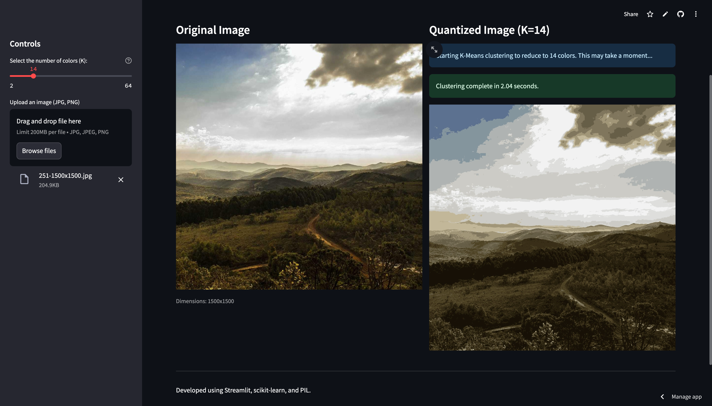

# 🎨 K-Means Image Color Quantizer

This Streamlit application demonstrates **Color Quantization** (or color reduction) using the K-Means clustering algorithm.

The core function of the app is to take an input image and reduce the number of colors it contains to a user-specified value (K). This is achieved by clustering the RGB color space of the image's pixels. The center of each cluster becomes one of the new, reduced colors in the final image.

## 🔗 Try the Live Application

You can interact with the app and upload your own images here:

[**K-Means Color Quantizer App**](https://mlai-apps-byqbs65nd7djms7fzosebu.streamlit.app/)

## 📸 Application Screenshot



## 🚀 Local Setup and Run

To run this application on your local machine, follow these steps.

### 1. Prerequisites

You need Python installed. It is recommended to use a virtual environment (like Conda or `venv`) to manage dependencies.

### 2. Installation

Install all required Python packages using the `requirements.txt` file (which ensures version stability, especially for `protobuf`):

```bash
pip install -r requirements.txt
